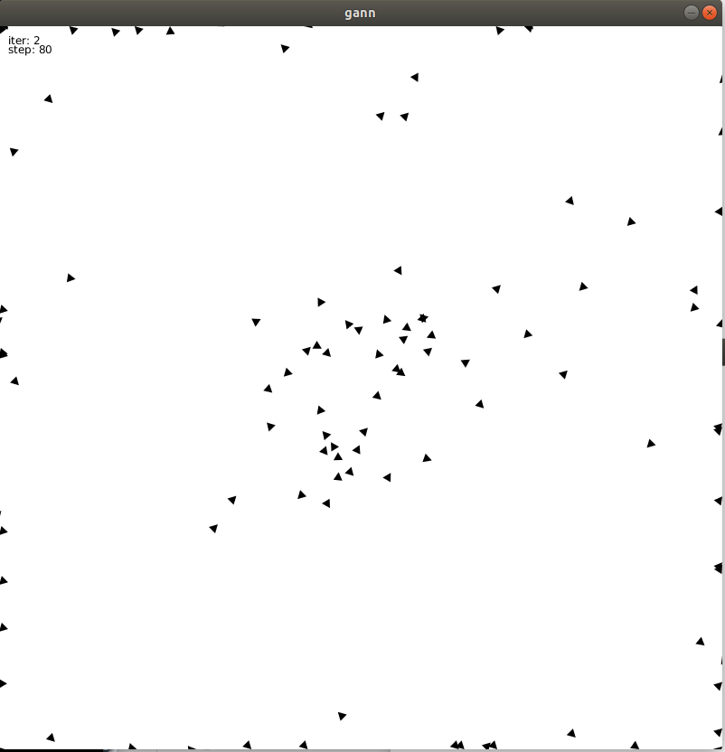

# processing-ga-optimized-nn
Demonstrate of Genetic algorithm optimized Neural Network for 2D position control using Processing (a graphic library). The objective is to control an agent to reach the center as much as possible.

A neural network is represented as:

In this example, the # of inputs = # of outputs = 2, and the # of hidden layers = 10.

Initially, the agents performed not very well:

After ~50 iterations, the agents coverage to:

